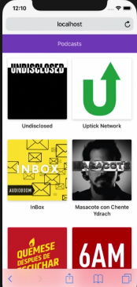

# Podcastiny
Podcastiny is a web app for podcast and audio streaming. Created using NextJS and ReactJS\
It uses [AudioBoom](https://api.audioboom.com/) API\

## Cómo funcioná?
Requiere Node.JS >= v10

`npm install` para instalar las dependencias\
`npm run dev` para el entorno de desarrollo\
Opcional:\
`npm run build && npm start` para el entorno de producción

## Licencia

MIT